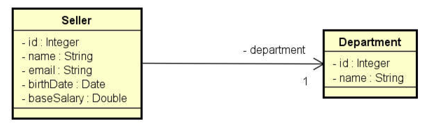
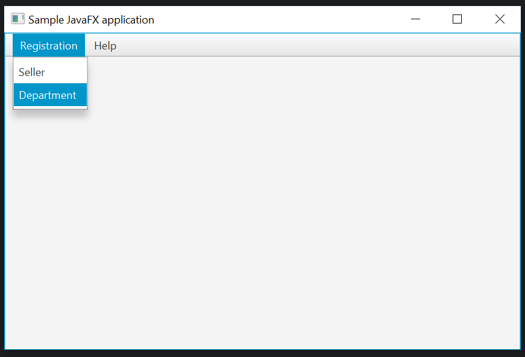
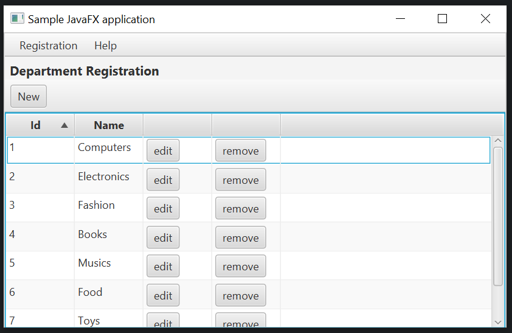
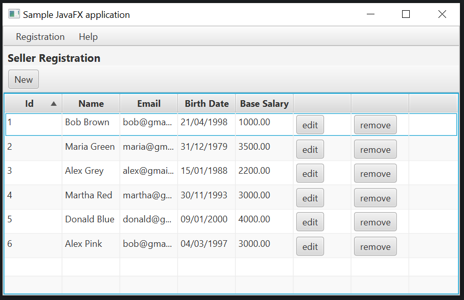
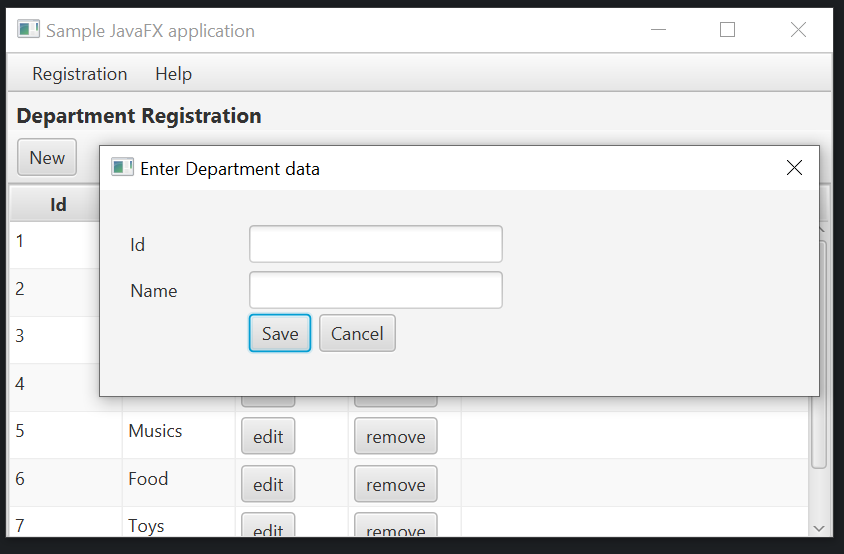
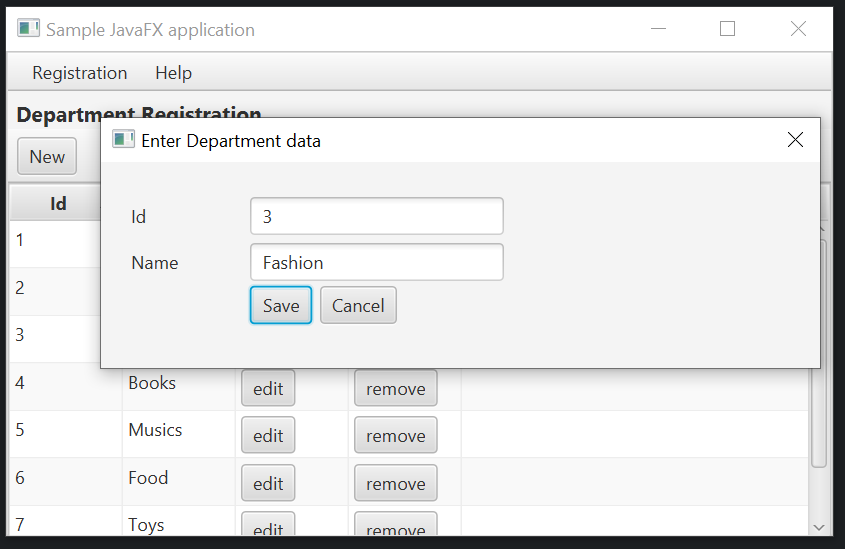
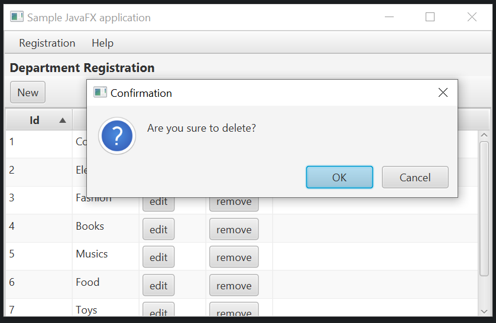
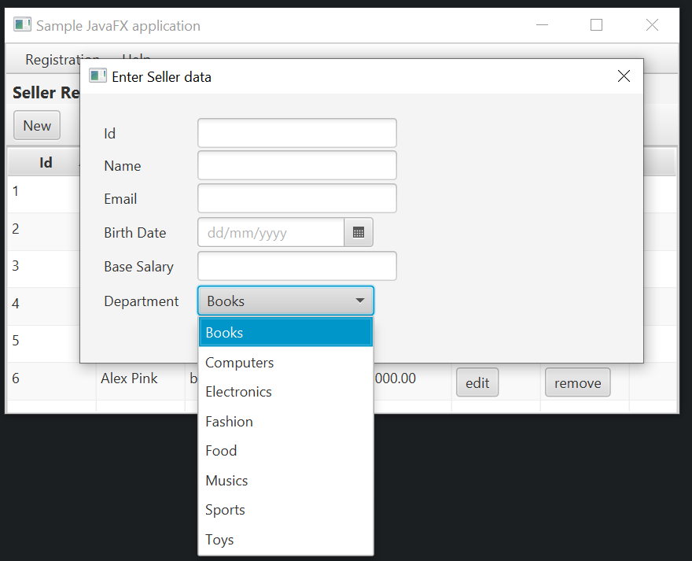
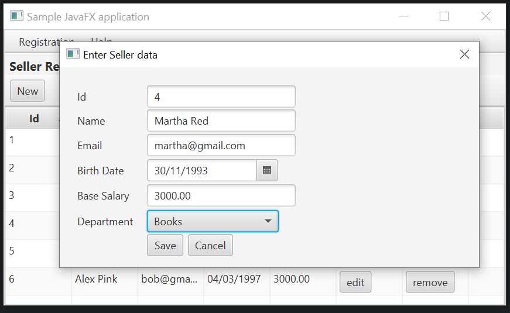
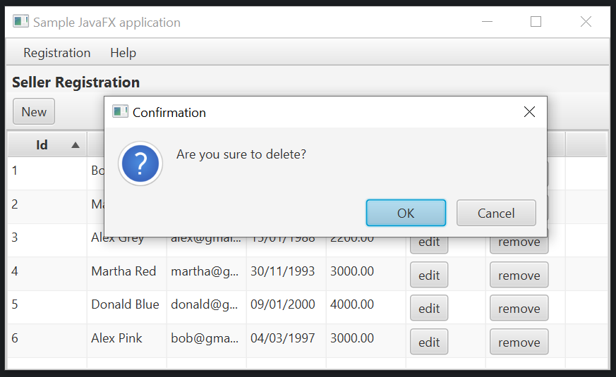

# workshop-javafx-jdbc

CRUD Application with JavaFX using FXML and MySQL using JDBC.

The UML diagram used is shown below.

Accessing all departments and sellers:

Adding a new department:

Editing:

Deleting:

Adding a new seller:

Editing:

Deleting:

